# RFID Multi-UID Switchable CARD + BLE HID Remote Shutter
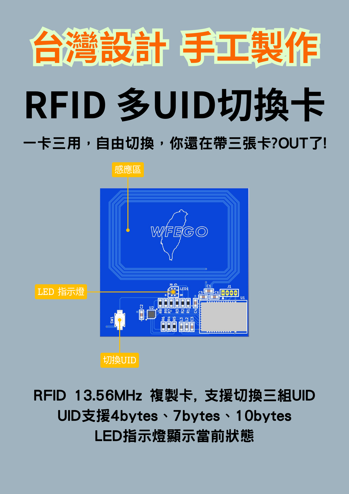   
## 為什麼要做這個專案   
在日常生活中，門禁卡、電梯卡、停車場卡與公司識別卡逐漸增加，經常需要攜帶多張 RFID 卡片，不僅容易遺失，也降低使用便利性。因此，我開始思考：

是否能將多張 RFID 卡整合至單一裝置中，並透過簡單操作快速切換身份？   

因此，我開始規劃一款：

* 可切換多組 UID
* 具備 LED 狀態顯示
* 支援按鍵操作
* 可攜帶且低功耗

的 RFID Switchable Card.   

**此專案不只是 RFID 複製功能的實作，更是一個從需求分析、硬體設計、韌體開發到產品化驗證的完整實踐。**  

## 設計脈絡   
本專案最初從「一卡多身份」的概念出發，並逐步建立完整功能架構。   

### 初期目標   
初版需求相對單純：   
* 儲存多組 RFID UID.   
* 透過按鍵切換 UID.   
* 使用 LED 顯示目前狀態.   
* 學習UID希望使用手機進行學習，不需額外的工具.   

但在實際使用與測試後，我發現：   
* 使用者容易忘記目前是哪一組 UID.   
* 單色 LED 的辨識度不足.   

因此後續加入：
* 多色 LED 顏色識別.   
* UID 與燈號對應.   
* 低功耗待機設計.   
* DFU.   

並開始朝向：
**「真正可日常攜帶使用的產品」**

### 整體設計流程包含：
* 功能需求定義.   
* MCU 與 RFID 晶片選型.   
* 電源架構規劃.   
* PCB Layout 與尺寸優化.   
* 韌體架構設計.   
* UID 管理邏輯實作.   
* 實機驗證與除錯.   
* 外殼與產品化設計.   

### 衍生   
後來又有需求，希望可以結合拍照功能，於是再整合了BLE HID功能.
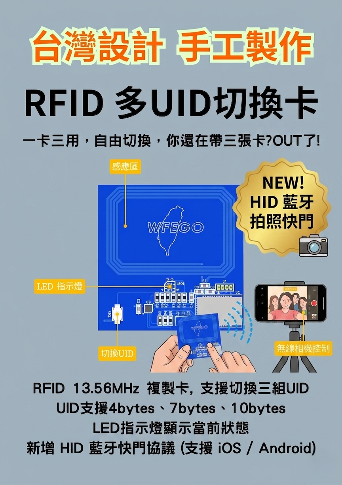   

## 硬體方面   
### MCU 與控制架構   
系統核心採用低功耗 MCU 作為主控制器，負責：   
* UID 管理.   
* 按鍵偵測.   
* LED 控制.   
* UID 切換.   
* EEPROM / Flash 資料管理.   

### RFID功能設計   
* 天線匹配.   
* PCB Coil Layout.   

### LED 狀態設計   
為提升使用體驗，
不同 UID 會對應不同燈號顏色，例如：
* 紅色: UID 1.   
* 綠色: UID 2.   
* 橘色(紅色 + 綠色): UID 3.   

透過 多色 LED：   
* 可快速辨識目前身份.   
* 提升產品互動性.   
* 增加科技感與視覺回饋.   

### PCB 設計   
PCB 使用 KiCad 進行設計，重點包含：   
* 小型化 Layout.   
* RFID 天線區域規劃.   
* LED 與按鍵位置配置.   
* 電源 Routing.   
* GND Plane 完整性.   
* 感應區域避開干擾.   

## 機構方面   
除了電子硬體與韌體開發外，本專案亦包含機構設計與產品外觀整合，目標是讓 RFID Switchable Card 不只是功能驗證板，而是一個具備日常使用便利性的實體產品.   

### 機構設計思維   
在規劃機構時，我主要考量以下幾個方向：   
* 卡片尺寸與攜帶性.   
  * 可放入口袋.   
  * 接近門禁卡使用習慣.   
  * 長時間攜帶舒適性.   
* 按鍵操作.   
  * 單手操作便利性.   
  * 按壓回饋感.   
  * 按鍵與外殼開孔對位.   
* LED 視覺呈現   
  * 保留導光.   
  * 避免 LED 被遮蔽.   
  * 提升不同顏色辨識度.   
* 外殼與結構整合   
  * PCB 固定方式.   
  * 卡扣.   
  * 電池空間配置.   
  * RFID 感應區避讓.   
  * 組裝與維修便利性.   
* 3D 建模與原型驗證   
  * 外觀尺寸規劃.   
  * PCB 與機構配合設計.   
  * 3D Model 建立.   
  * 原型列印.   
  * 實體裝配與修正.   

### 機構開發過程中的挑戰   
此專案在機構整合上，最大的挑戰並非單純外觀設計，而是：   
`在有限空間內，同時兼顧 RFID 感應、電路配置、按鍵操作與產品外型`.

### 機構設計成果   
透過機構設計的導入，本專案從單純的電子模組，進一步提升為具備：   
* 攜帶性.   
* 操作性.   
* 視覺辨識.   
* 保護性.   
* 產品完整度.   

**組合圖**
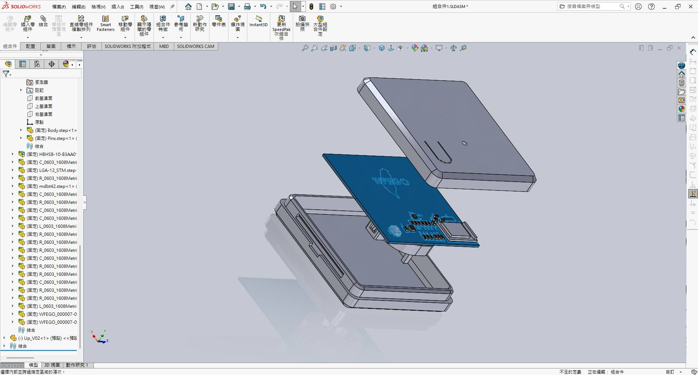   

**外殼造型演進**   
單色 -> 多色打印 -> 識別證掛環 -> 鑰匙圈掛環設計.   
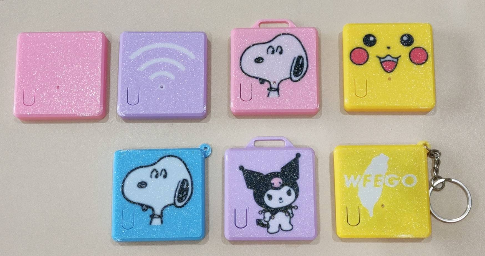   

## 軟體方面   
### 韌體架構   
韌體採用Zephyr RTOS + 模組化設計，主要功能模組包含：   
Application Layer
* UID Manager(NVS)
* Button Handler(wl_button_thread)
* LED Controller
* Power Management(wl_battery_thread)
* RFID Control(wl_nfc_thread)
* WDT(wl_wdt_thread)

Driver Layer
* GPIO
* Timer
* Storage Driver

此架構可提升：   
* 可維護性.   
* 功能擴充性.   
* 除錯效率.   

### UID 切換邏輯   
系統透過按鍵中斷 偵測按鍵事件   
操作流程:   
* 使用者按下按鍵.   
* MCU 更新目前 UID Index.   
* 依據目前的UID Index, 更新Serial Number.   
* 更新LED顏色.   
* 儲存當前狀態.   

這樣可確保：   
* 重新上電後仍保留最後身份.   
* 切換過程快速且穩定.   

### 低功耗設計   
由於裝置需長時間攜帶使用，因此低功耗為重要設計目標.   

包含：   
* Idle/Sleep Mode.   
* LED 關閉策略.   
* 按鍵喚醒.   
* 降低待機電流.   

以提升電池續航能力.目前**待機電流約6uA**.   

### DFU（Device Firmware Update）功能設計   
為提升產品後續維護與功能擴充能力，本專案加入 DFU（Device Firmware Update）韌體更新機制，讓裝置在完成部署後，仍可進行韌體升級與功能更新.   
**DFU 觸發機制**
系統採用 Button + Power-On Trigger 的方式進入 DFU 模式.   
操作流程如下：   
* 按住功能按鍵.   
* 裝置上電.   
* MCU 於開機初始化階段偵測按鍵狀態.   
* 若符合條件，跳轉至 DFU / Bootloader.   
* 進入韌體更新模式.   

## 實作過程   
### 概念驗證（Prototype）   
初期先使用開發板驗證：   
* UID 切換.   
* 按鍵控制.   
* LED 顯示.   

確認功能可行後，再進行客製化 PCB 設計

**Schematic**   
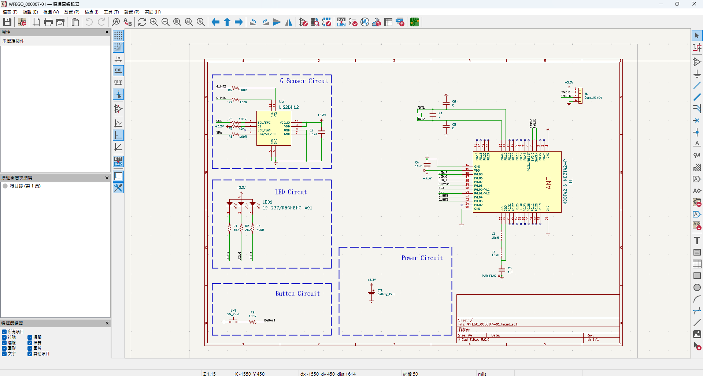   

**PCB Layout**.   
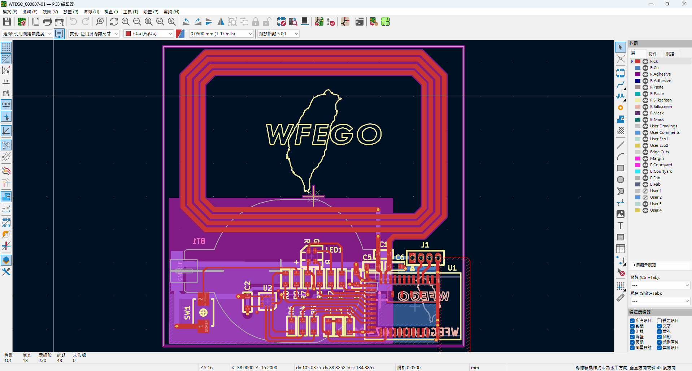   

**3D渲染圖**   
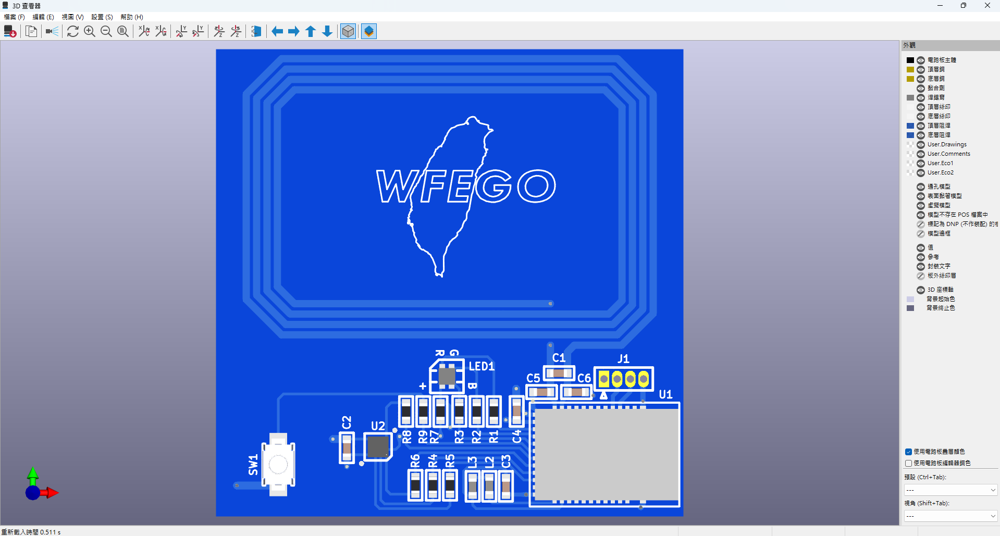   

### PCB 打樣與測試   
完成原理圖與 Layout 後，進行 PCB 打樣與焊接測試.   
* Kicad的`Fabrication Toolkit`非常的便利，一鍵打包`Gerber檔`，上傳至[JLCPCB](https://jlcpcb.com/hk)進行打樣.發包後大約一個禮拜就可收到.   
* 也順便把Gerber檔發給鋼片廠製作鋼片.   
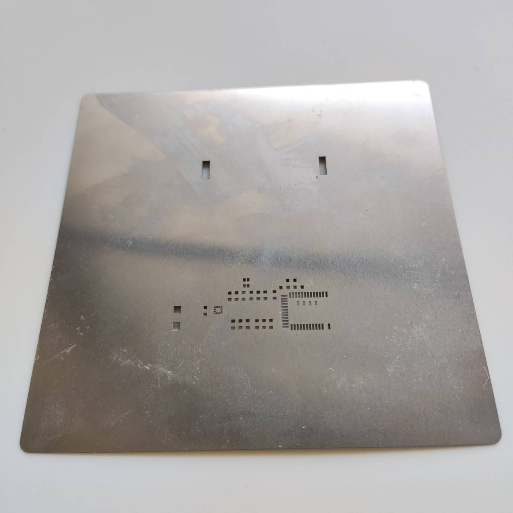   
* PCB板回來後，使用FreeCAD繪製鋼片治具，以利後續刷錫膏上加熱平台.   
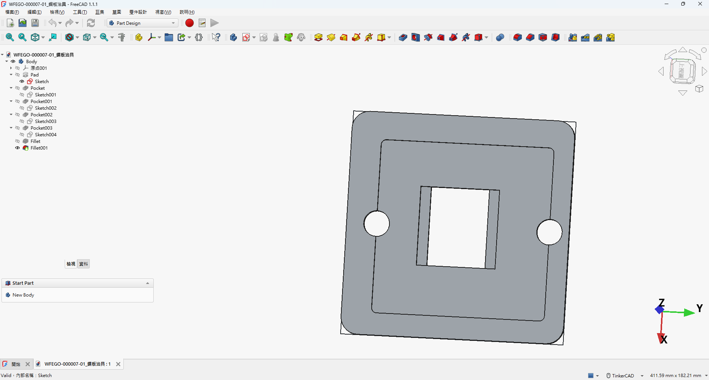   
* 繪製完鋼片治具後，使用3D Printer列印出來(打上板號，以利後續辨識).   
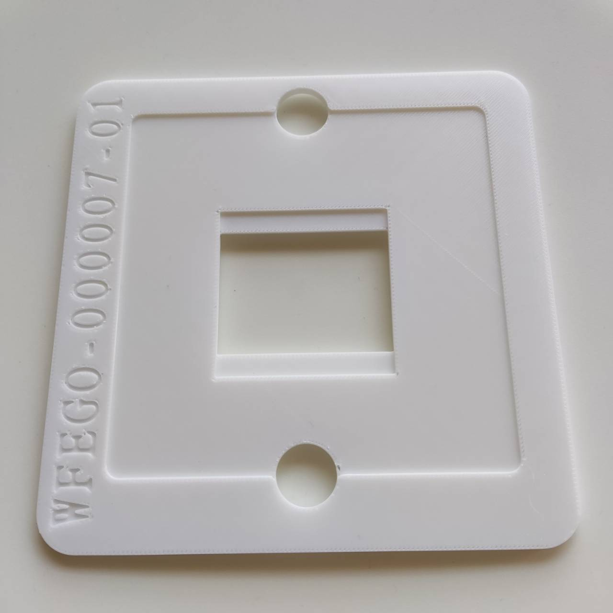   
* 將PCB板放至鋼片治具上.   
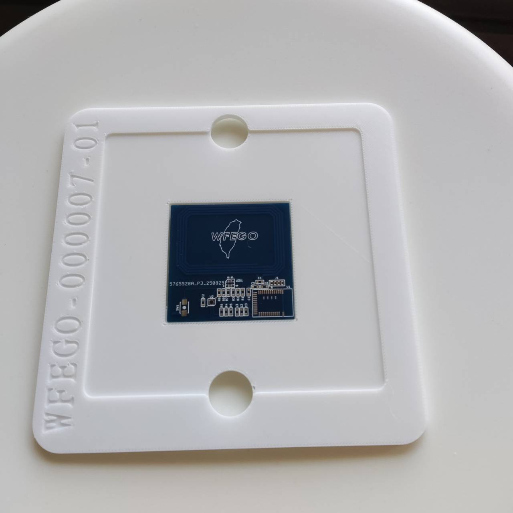   
* 將鋼片放置鋼片治具上，並核對位置.
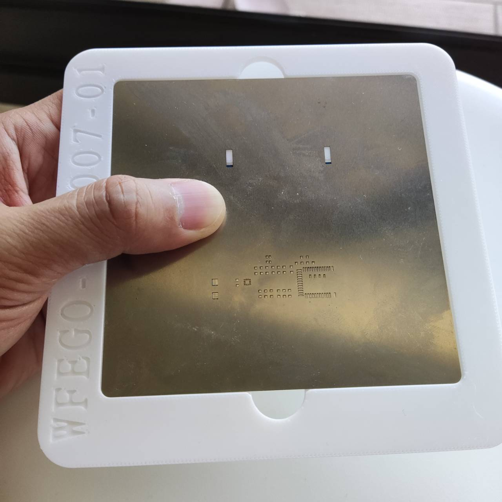   
* 刷錫膏，刷完錫膏並擺放元件.擺放完成後，再將PCB板上加熱平台.   
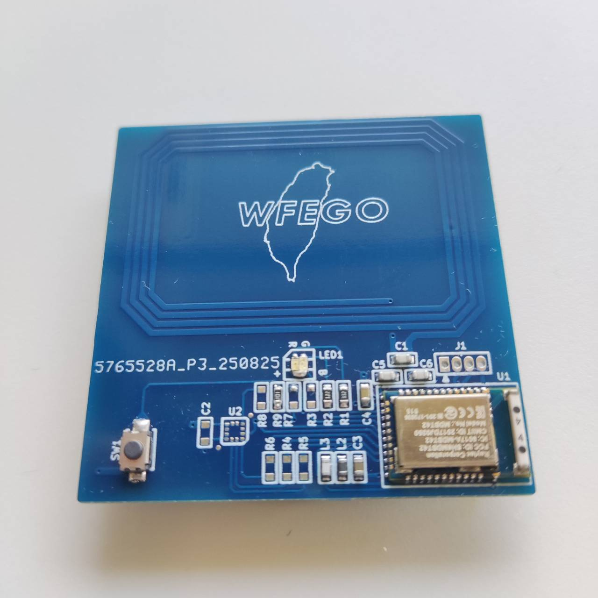   

### 韌體除錯   
韌體開發過程中，   
需處理：
* 狀態同步.   
* UID 儲存.   
* 按鍵誤觸.   
* 上電初始化.   
並透過：
* RTT Log.   
* Power Profiler Kit II.   
進行問題分析與驗證.   

### 產品化思維   
除了功能實現外，   
此專案也加入產品化考量：   
* 外殼設計.   
* 攜帶便利性.   
* 操作直覺性.   
* 視覺辨識度.   
* 使用者體驗.   

並進一步應用於：   
* 個人作品集展示.   
* 技術能力驗證.   
* 社群推廣.   
* 商品化實驗.   

## 商品
* [產品規格](https://github.com/letter57/WFEGO_000007)   
* [外殼模型下載](https://makerworld.com/zh/models/1880643-rfid-cloning-card#profileId-2013693)

## 影片展示   
* [RFID 多UID切換展示](https://www.youtube.com/shorts/AE6tyUR27vs)   
* [RFID 多UID應用情境展示](https://www.youtube.com/watch?v=bB62DOSFjHc)   

