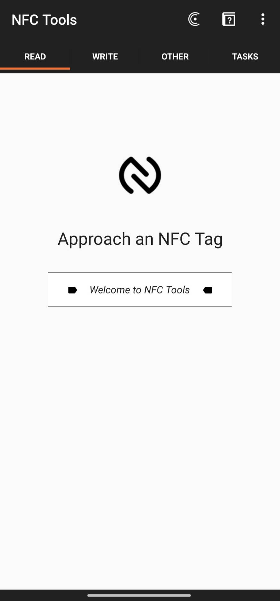

# RFID多UID切換卡｜三組身份隨時切換｜LED指示｜支援門禁打卡｜台灣設計製造 WFEGO
   

> 一張卡，三個身份，自由切換！支援 13.56MHz RFID 複製，內建按鍵切換與 LED 狀態顯示，方便快速辨識目前身分。

---

## 🎯 功能特色   
- ✅ 支援三組 UID 儲存與切換.   
- ✅ 一鍵切換身份，操作簡單直覺.   
- ✅ LED 狀態指示，清楚顯示目前所使用的身份.   
- ✅ UID支援長度: 4bytes、7bytes、10bytes.   
- ✅ 透過具備`NFC功能的手機`及 `NFC Tools` App 即可進行UID拷貝.

---

## 💡 技術規格   
| 項目 | 規格 |
| ---- | ---- |
| 工作頻率 | 13.56MHz |
| 通訊協議 | ISO/IEC 14443-3 |
| UID 支援長度 | 4 bytes, 7 bytes, 10 bytes |
| LED 顯示 | 紅燈, 綠燈, 黃燈(紅 + 綠) |
| 控制介面 | 單一按鍵 |
| 電源 | CR2032 |

---

## 🔧 所需工具   
* 手機 (需支援NFC功能).   
* NFC Tools App
  * [Android](https://play.google.com/store/apps/details?id=com.wakdev.wdnfc&hl=zh_TW)   
  * [IOS](https://apps.apple.com/tw/app/nfc-tools/id1252962749)   
* 欲複製的RFID卡.   
* 本產品 WFEGO RFID 多UID切換卡.   

---

## 🚀 拷貝 UID 操作步驟   
1. 打開`NFC Tools` App.   
2. 點選`READ` -> 將欲複製的卡片靠近手機NFC感應區.
     
3. 讀取到卡片資訊後，點選`Serial number`, 如下圖 1 所指處. 點選`Copy to clipboard`, 如下圖 2 所指處.   
     
4. 點選`WRITE`, 如下圖 1 所指處. 點選`Add a record`, 如下圖 2 所指處.   
     
5. 點選`Text`, 如下圖 1 所指處.   
     
6. 長按`Hello`, 如下圖 1 所指處. 點選`貼上`, 如下圖 2 所指處. 點選`OK`, 如下圖 3 所指處.   
     
7. 如果只有一組的話，建議還是建立三組`Add a record`中的`Text`.方便後續的修改.重複`步驟4 ~ 步驟6`.   
8. 如果有三組的話，則重複`步驟2 ~ 步驟6`.   
9. 三組UID建立完成，如下圖所示.   
     
10. 點選`Write / 54 Bytes`, 如下圖 1 所指處.   
  * `54 Bytes`會依據不同的卡片(UID 長度不同)得到不同的數值.   
     
11. 將手機靠近本產品，寫入UID.   
     
12. 確認是否有寫入成功, 如下圖所示.   
     

---

## 🎯 身分切換說明   
* 按鍵`短按一次`: 切換至下一組UID.   
* LED狀態顯示:   
  * 🔴 紅燈 → 身分 A.   
  * 🟢 綠燈 → 身分 B.   
  * 🟡 黃燈（紅+綠）→ 身分 C.   
* UID 對應的燈號如下圖所示   
     

---

## 🎯 使用模式   
- 切換至所需身份後，將卡靠近門禁機或讀卡機即可.   

## 📹 示範影片   

---

⚠️ 注意事項   
* 本產品為電子實驗用途，請確認您使用的門禁系統支援 ISO/IEC 14443-3 協議。   
* 不支援有鎖卡 & 認證.   
* 非法使用他人門禁系統將自行負責，本產品僅供個人學習與整合應用。   

---   

## 📬 購買   
- Shopee 蝦皮商店 👉 [點我購買](https://shopee.tw/RFID%E5%A4%9AUID%E5%88%87%E6%8F%9B%E5%8D%A1%EF%BD%9C%E4%B8%89%E7%B5%84%E8%BA%AB%E4%BB%BD%E9%9A%A8%E6%99%82%E5%88%87%E6%8F%9B%EF%BD%9CLED%E6%8C%87%E7%A4%BA%EF%BD%9C%E6%94%AF%E6%8F%B4%E9%96%80%E7%A6%81%E6%89%93%E5%8D%A1%EF%BD%9C%E5%8F%B0%E7%81%A3%E8%A8%AD%E8%A8%88%E8%A3%BD%E9%80%A0-WFEGO-i.26640381.27236823094)